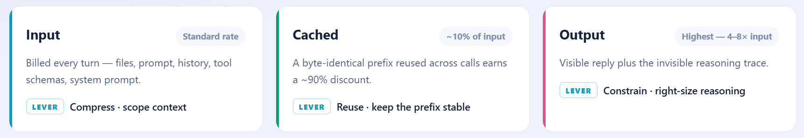

# Exercise 00 — Setup & UBB Foundations

**Duration:** 15 minutes  
**Optimization strategies/techniques covered:** All (baseline)  
**Goal:** Start the app, understand what tokens actually cost under UBB, and record your baseline before any optimisations.

---

## Why UBB changes everything

Under the flat-seat model you paid the same regardless of usage. Under **Usage-Based Billing**, every request is a line item:

```
Your 20-character prompt → 2,000+ tokens billed
```

The reason: your prompt is only the visible tip. Five hidden layers load before it reaches the model.


| Layer | What it contains | Editable? |
|-------|-----------------|-----------|
| System prompt | Copilot-bundled instructions | ❌ No |
| Repo instructions | Your `copilot-instructions.md` | ✅ Yes |
| File context | `#file` refs + auto-included neighbors | ✅ Yes |
| Conversation history | Every prior turn in this session | ✅ Yes (via `/compact`) |
| Tool schemas | All enabled MCP tool descriptions | ✅ Yes |
| **Your prompt** | What you actually typed | ✅ Yes |

> **Hidden structural overhead is typically 90%+ of a request.**

---

## The three billing lanes


| Lane | What it is | Price multiplier |
|------|-----------|-----------------|
| INPUT | Prompt + context + system | 1× |
| CACHED | KV-cache hits from prior turns | ~0.1× |
| OUTPUT | Model's generated reply | **4×–8×** |

**The highest-ROI action in this entire workshop:** constrain output once, save 60–80% per task, forever.

---

## UBB pricing reference (June 1, 2026)

| Model | Input /1M | Cached /1M | Output /1M | Ratio |
|-------|-----------|-----------|-----------|-------|
| GPT-5 mini | $0.25 | $0.025 | $2.00 | 8× |
| GPT-4.1 | $2.00 | $0.50 | $8.00 | 4× |
| Claude Sonnet 4.6 | $3.00 | $0.30 | $15.00 | 5× |
| Claude Opus 4.7 | $5.00 | $0.50 | $25.00 | 5× |

---

## 1. Start the app

```bash
cd future-you-simulator
npm install
npm run dev
# → http://localhost:5173
```

Complete the onboarding (name, age, one goal, one habit).
<!--add some boosting-->
---

## 2. Enable token visibility
1. Click on 3 dots in copilot chat("**views and more**) click on **Agent Debug Logs** panel and click on "**Enable in Settings**"
2. Open the **Agent Debug Logs** panel (bottom panel → select **Agent Debug Logs** tab)
3. After each request completes, the **Summary** section shows `Total Input Tokens`,`Total Output Tokens`, `Total Cached`, `Copilot Usage (AIC)`.

> **Note:** `Copilot Usage (AIC)` is the primary billing metric under UBB — this is what you will track across all exercises.

---

## 3. Record your baseline — the wasteful prompt

Open Copilot Chat (`Ctrl+Shift+I`) and run this **exactly as written**:

```
I am working on a React TypeScript application. Can you look through all 
the files in my project and help me understand how the whole app works, 
give me a full summary of every component, every utility, the state management 
approach, and then suggest 5 new features I could add?
```

Open the **Agent Debug Logs** panel and record from the **Summary** section:

| Metric | Value |
|--------|-------|
| Total Output Tokens | |
| Total Cached | |
| Copilot Usage (AIC) | |
| Model used | |

**Baseline AIC cost: ___________**

---

## 4. Identify what made it expensive

| Anti-pattern in the prompt | Why it costs |
|---------------------------|-------------|
| "look through all the files" | Triggers full workspace index scan |
| "every component, every utility" | Forces a long, verbose completion (output × 4–8) |
| No file attached | Model pulls broad workspace context |
| "5 new features" | Multiplies output tokens with open-ended generation |

This prompt is intentionally wasteful. By Exercise 10 you will complete the same task for **~90% fewer tokens**.

---

## 5. Identify the token iceberg for this prompt

```
[System prompt: ~800 t] + [Workspace index: ~6,000 t] + [Your prompt: ~50 t]
                       = ~6,850 input tokens
                       + ~1,200 output tokens (verbose summary)
                       = ~8,050 total
                       
Your actual typed words were < 1% of the bill.
```

> **Every optimisation in this workshop attacks one or more of these layers. A 90% reduction by Exercise 10 is realistic because the hidden layers are large and mostly controllable.**

---

## Checkpoint ✓

- [ ] App running at `localhost:5173`
- [ ] Agent Debug Logs panel showing Copilot usage data
- [ ] AIC cost calculator bookmarked
- [ ] Baseline AIC cost recorded
- [ ] Understand the 5 hidden context layers
- [ ] Understand input / cached / output pricing lanes

---

**Next:** [Exercise 01 — Prompt Compression & Language Tax](exercise-01-prompt-compression.md)


