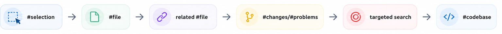

# Exercise 02 — Context Management & The Escalation Ladder

**Duration:** 20 minutes  
**Lever:** 3 (Context Management)  
**Potential saving:** 30–90% input tokens  
**App focus:** `src/components/LifeTimeline/LifeTimeline.tsx`, `src/store/useStore.ts`

---

## The context window iceberg

Every Copilot request layers these sources before your prompt reaches the model:

```
[System prompt ~800t] + [Instructions ~50t] + [File context ~varies] + [History ~grows] + [Your prompt ~50t]
                                                                                          ↑
                                                                             Usually < 1% of the bill
```

Agent runs commonly accumulate **50,000+ tokens per session** due to context reload, growing history, and repeated tool schemas.

---

## Part A — The VS Code Context Escalation Ladder

**Start narrow. Widen only when the task genuinely requires it.**



| Mention | Use when | Avoid when | Token cost |
|---------|----------|-----------|-----------|
| `#selection` | Refactoring a few highlighted lines | Question spans the whole file | Lowest |
| `#file:Lx-Ly` | Known function/block with line range | You don't know the exact lines | Low |
| `#file` | Whole small file (< 300 lines) is relevant | File > 500 lines, only partly relevant | Medium |
| `#codebase` | Cross-file architecture questions | Local question — **10×–50× token waste** | Highest |
| `#terminalSelection` | Debugging the exact error shown | Generic "why did this break?" | Targeted |
| `#problems` / `#testFailure` | Fixing a specific diagnostic or test | Speculative debugging | Targeted |

> **The 80/20 rule:** 80% of prompts only need `#selection` or `#file:Lx-Ly`. Reserve `#codebase` for architecture work — never for "add a button."

**Practical `#file:Lx-Ly` usage:** Open `src/utils/progressCalculator.ts` and locate the `computeProjection` function. Note its start and end line numbers, then use `#file:src/utils/progressCalculator.ts:L{start}-L{end}` to attach only that function. This targets a few hundred tokens instead of the whole file.

---

### Step 1: Measure `#codebase` vs `#file` for a local question

**With `#codebase` (expensive):**

In Copilot Chat, type:
```
#codebase How does the LifeTimeline component render timeline events?
```

Record (from Agent Debug Logs → Summary): **#codebase: ___________**

---

**With `#file` (precise):**

Attach only `src/components/LifeTimeline/LifeTimeline.tsx`:
```
How does this component render timeline events?
```

Record (from Agent Debug Logs → Summary): **#file: ___________**

**Ratio (codebase / file): ___________  (expect 10×–50×)**

> This ratio is your single biggest cost lever in everyday work. A developer who uses `#file` instead of `#codebase` for local questions saves 10×–50× on context tokens every single time.

---

### Step 2: Measure `#selection` vs full file

1. Open `src/store/useStore.ts`
2. Highlight only the `addGoal` function (typically 5–8 lines)
3. In Copilot Chat, use `#selection`:
```
What does this function do? One sentence.
```

Record (from Agent Debug Logs → Summary): **#selection: ___________**

4. Now attach the whole file `#file:src/store/useStore.ts` and ask the same question

Record (from Agent Debug Logs → Summary): **#file (whole): ___________**

---

## Part B — Session lifecycle: history accumulates

**The compound cost problem:**

| Turn | Question tokens | Actual context size |
|------|----------------|---------------------|
| 1 | 50 | ~850 |
| 5 | 50 | ~1,250 |
| 10 | 50 | ~2,700 |
| 20 | 50 | ~6,500 |
| 30 | 50 | ~14,000 |

At turn 30, conversation history is **≈90% of the bill**.

### Step 3: Observe session drift

In a **single chat**, run these prompts in sequence without starting a new chat:

```
Explain how useStore manages the user profile.
```
```
What is the persist middleware doing in the store?
```
```
Attach src/components/LifeTimeline/LifeTimeline.tsx. How are events sorted?
```
```
Add a "today" marker line to the timeline. Show only the JSX change.
```

Record (from Agent Debug Logs → Summary) on the **last prompt** (history accumulated): **With drift: ___________**

---

### Step 4: Same task, fresh chat

1. Open a **new chat**
2. Attach only `src/components/LifeTimeline/LifeTimeline.tsx`
3. Run directly:

```
Add a "today" marker line to the timeline — a horizontal rule with "Today" label. 
Show only the JSX change. Use text-neon-cyan and border-neon-cyan/30 Tailwind classes.
```

Record (from Agent Debug Logs → Summary): **Fresh chat + right file: ___________**

**Saving: ___________**

Apply this change to the component.

---

## Part C — Session management actions

| Action | When to use | Token impact |
|--------|-------------|-------------|
| `/compact` | Long thread, still same task | **70–85% history saved** |
| `/fork` | Side question — want to return to main thread | Keeps parent clean |
| Start new chat | Topic shifts, task complete | **100% history reset** |
| Archive daily | Even successful sessions | Prevents creep |
| Save to AGENTS.md | Key decision / constraint | Permanent, cheap |

> **Rule:** If you can't summarise the chat in one sentence, use `/compact` or start fresh. Don't keep paying to carry the noise.

---

### Step 5: Try `/compact` in a long thread

**Scenario:** You've spent 15 turns debugging the `LifeTimeline` sort logic. The thread is long but the task isn't done yet.

1. In the **same chat**, type:
   ```
   /compact
   ```
2. Copilot replaces the full history with a summary (~200 tokens vs the original ~8,000).
3. Continue with:
   ```
   Attach src/components/LifeTimeline/LifeTimeline.tsx. Now add the "today" marker we discussed.
   ```
4. Record tokens on the next prompt — should be dramatically lower than before `/compact`.

> Use `/compact` when: history > 10 turns AND the task is still in progress.

---

### Step 6: `/fork` — Branch without losing your place

**Scenario:** You're mid-way through adding the "today" marker. A colleague asks about the store — you want to answer without polluting the timeline thread.

1. In the current chat, type:
   ```
   /fork
   ```
2. In the **forked chat**, ask:
   ```
   #file:src/store/useStore.ts What does the persist middleware do? One sentence.
   ```
3. Answer the side question, then **close the fork** and return to the original chat.
4. The original thread retains zero context from the side question.

> Use `/fork` when: you have a one-off side question and want to return to the main thread unchanged.

---

### Step 7: Start new chat — Full reset

**Scenario:** You've finished adding the "today" marker. Now you want to work on the `OnboardingForm` — a completely different component.

1. Click **New Chat** (or `Ctrl+Shift+I` → New Chat).
2. Attach only the relevant file for the new task:
   ```
   #file:src/components/Onboarding/OnboardingForm.tsx
   ```
3. Ask your question with no prior history overhead:
   ```
   Add a "timezone" dropdown field after the name input.
   ```

> Use a new chat when: the topic shifts, the previous task is done, or you're starting a completely different feature.

---

### Step 8: Save to AGENTS.md — Persist a decision cheaply

**Scenario:** You've decided all timeline events must use `date-fns` for formatting (not `toLocaleDateString`). You want every future chat to know this without repeating it.

1. Open (or create) `future-you-simulator/AGENTS.md`.
2. Add one line under a `## Conventions` heading:
   ```markdown
   ## Conventions
   - Timeline dates: always format with `date-fns/format`, never `toLocaleDateString`.
   ```
3. This file is loaded as a flat instruction (~10 tokens) instead of you re-explaining it in every chat (~50–80 tokens each time).

> Use AGENTS.md for: constraints, library choices, naming rules — anything that applies permanently across sessions.

---

## Part D — Scoped instructions with `applyTo`

Instead of loading all instructions every turn, scope them to relevant file paths.

### Step 9: Create a scoped instruction file

Create `.github/instructions/timeline.instructions.md` inside `future-you-simulator/`:

```markdown
---
applyTo: "src/components/LifeTimeline/**"
---
Timeline uses recharts. Events sorted by date descending.
Colour coding: past = neon-purple, future = neon-cyan.
```

This file loads **only** when working on LifeTimeline files, not on every turn.

### Step 10: Test the scoped instruction

Run the **relevant** prompts first (instruction file should load), then the **irrelevant** prompt (instruction file should NOT load). Check Agent Debug Logs after each to confirm.

**Relevant prompt 1** — open `src/components/LifeTimeline/LifeTimeline.tsx`, then ask:
```
Add a tooltip to each timeline event showing the full date. Follow the project colour coding.
```
> Expected: `timeline.instructions.md` appears in the debug log. Copilot knows to use `neon-purple`/`neon-cyan` and recharts without you saying so.

**Irrelevant prompt** — open `src/components/Onboarding/OnboardingForm.tsx`, then ask:
```
Add a character counter below the name input field.
```
> Expected: `timeline.instructions.md` does **not** appear in the debug log. The `applyTo: "src/components/LifeTimeline/**"` pattern does not match `Onboarding/`, so the instruction is skipped — zero wasted tokens.

---

## Checkpoint ✓

- [ ] Measured `#codebase` vs `#file` ratio (recorded multiplier)
- [ ] Measured `#selection` vs full file
- [ ] Observed session drift across 4 turns
- [ ] Measured fresh-chat saving
- [ ] Applied "today" marker to LifeTimeline
- [ ] Created scoped `applyTo` instruction file

---

**Next:** [Exercise 03 — Output Control](exercise-03-output-control.md)
